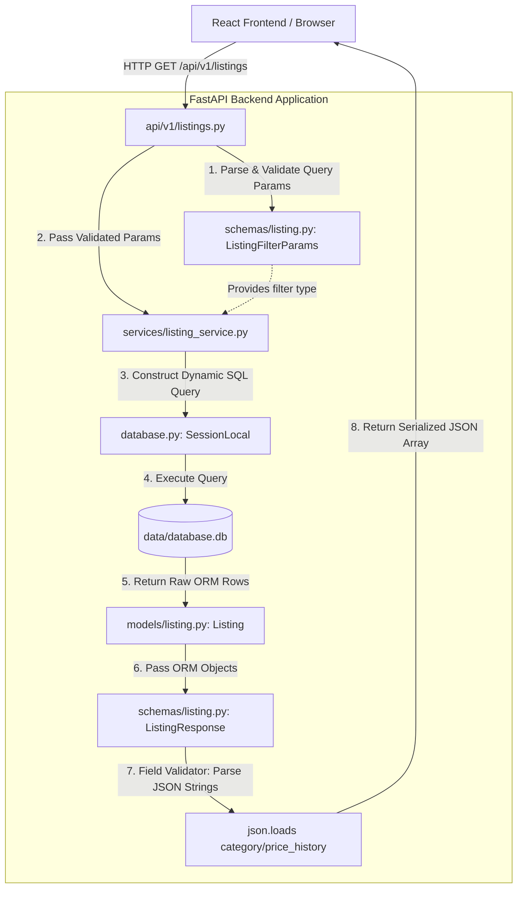
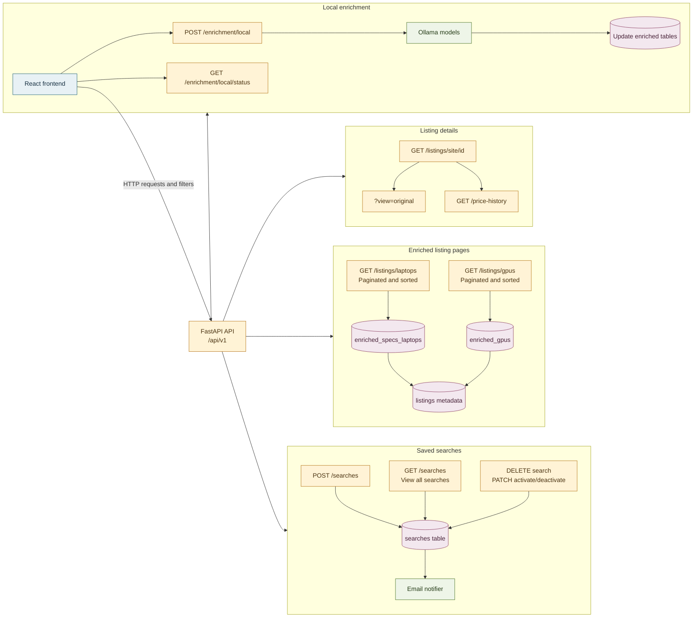

## API Plan

The API will initially expose saved searches and a local enrichment trigger. Search records map to the existing `searches` table; `filters` is stored as a JSON string and `is_active` controls whether the notifier evaluates the search.



### Saved Searches

| Method | Endpoint | Purpose | Database action |
| --- | --- | --- | --- |
| `POST` | `/api/v1/searches` | Add a saved search. | Insert a row into `searches` with `email`, `search_name`, `category`, `filters`, and `is_active = true`. |
| `GET` | `/api/v1/searches` | View all saved searches. | Read all rows from `searches`, including both active and inactive searches, and deserialize the `filters` JSON string. |
| `DELETE` | `/api/v1/searches/{search_id}` | Remove a saved search permanently. | Delete the matching row from `searches`. |
| `PATCH` | `/api/v1/searches/{search_id}/activate` | Resume a saved search for notifications while retaining it. | Set `is_active = true`. |
| `PATCH` | `/api/v1/searches/{search_id}/deactivate` | Stop a search from being used for notifications while retaining it. | Set `is_active = false`. |

The list endpoint should return saved searches in a stable order, such as `search_id ASC`, and support pagination with `skip` and `limit` query parameters.

#### Create Search Request

```json
{
    "email": "user@example.com",
    "search_name": "Affordable RTX laptop",
    "category": "laptops",
    "filters": {
        "enriched_brand": "Any",
        "max_price": 300000
    }
}
```

#### Search Response

```json
{
    "search_id": 1,
    "email": "user@example.com",
    "search_name": "Affordable RTX laptop",
    "category": "laptops",
    "filters": {
        "enriched_brand": "Any",
        "max_price": 300000
    },
    "is_active": true
}
```

The API should return `201 Created` when a search is added, `204 No Content` after a successful delete, activation, or deactivation, and `404 Not Found` when `search_id` does not exist. Activation and deactivation should be idempotent: activating an already active search or deactivating an already inactive search succeeds without changing its meaning. Use explicit activate and deactivate endpoints rather than a toggle so retries and concurrent requests remain predictable.

### Listing APIs

The frontend should display enriched listing data by default. The original scraped listing remains available as an explicit secondary view for inspecting the source row.

| Method | Endpoint | Purpose | Default behavior |
| --- | --- | --- | --- |
| `GET` | `/api/v1/listings/{site}/{id}` | Return one listing for a detail view. | Return the enriched listing view when enrichment exists; include an option such as `?view=original` to return the original scraped row. |
| `GET` | `/api/v1/listings/laptops?sort=price&direction=asc&include_iced=false&skip=0&limit=20` | Browse enriched laptop listings. | Read from `enriched_specs_laptops`, join the matching `listings` row for shared metadata, exclude archived rows, and hide iced rows by default for the frontend. |
| `GET` | `/api/v1/listings/gpus?sort=price&direction=asc&include_iced=false&skip=0&limit=20` | Browse enriched GPU listings. | Read from `enriched_gpus`, join the matching `listings` row for shared metadata, exclude archived rows, and hide iced rows by default for the frontend. |
| `GET` | `/api/v1/listings?sort=price&direction=asc&include_iced=false&skip=0&limit=20` | Browse general or original listing records. | Exclude rows where `archived_at` is set. The frontend sends `include_iced=false` by default. Use a stable default sort such as `scraped_at DESC`. |
| `GET` | `/api/v1/listings/{site}/{id}/price-history` | Return the listing's price changes. | Parse and return the existing `price_history` JSON as an array. |
| `GET` | `/api/v1/listings/{site}/{id}/specifications` | Return enriched product specifications. | Read from `enriched_specs_laptops` or `enriched_gpus`, depending on the listing type. |

#### Listing View Behavior

- Normal listing requests return only active rows: `archived_at IS NULL`.
    - Archived rows remain in the database for history and are not deleted.
    - The scraper owns archive state and sets `archived_at`; the frontend does not archive listings.
- The browse endpoint supports `include_iced=true|false`; when false, it excludes rows where `iced_status = true`.
- The frontend defaults to `include_iced=false` and provides a filter/toggle to show iced listings.
- The frontend's main listing pages use the paginated `/listings/laptops` and `/listings/gpus` endpoints.
- Those endpoints use the enriched tables as their primary data source and join the base `listings` table for shared fields such as price, location, and listing URL.
- Enriched collection endpoints apply both `archived_at IS NULL` and the `include_iced` filter.
- `?view=original` returns the scraped listing fields without replacing or deleting the enriched data.
- Listing identifiers must include both `site` and `id`, because the database uses a composite primary key.

The listing detail endpoint should return `404 Not Found` for a missing listing. The browse endpoint should return `listing_url`, which is stored in the database and is needed to open the original marketplace page.

### Local Enrichment

| Method | Endpoint | Purpose | Current implementation |
| --- | --- | --- | --- |
| `POST` | `/api/v1/enrichment/local` | Start local LLM enrichment for all currently unenriched supported listings. | Checks that Ollama is reachable, then starts the enrichment job with FastAPI `BackgroundTasks`. |
| `GET` | `/api/v1/enrichment/local/status` | Check the current enrichment job. | Returns the in-memory job status, including `idle`, `running`, `completed`, or `failed`. |
| `POST` | `/api/v1/enrichment/local/cancel` | Request cancellation of the active enrichment job. | Accepts the active `run_id` and cooperatively stops processing before the next listing or retry. |

The start endpoint returns `202 Accepted` with a run identifier because enrichment invokes Ollama and may take a long time. It returns `503 Service Unavailable` when Ollama cannot be reached, and `409 Conflict` when another enrichment job is already running. A lightweight in-memory job state is sufficient for this local quality-of-life feature; no external queue or worker system is needed.

The background job should call the existing orchestration in `enrichment.py`:

1. Call `get_non_enriched_ids_by_product_type()`.
2. Run `local_enrichment()` for the returned IDs.
3. Run the notifier if notification processing remains part of the manual workflow.

Cancellation should be cooperative: the cancel endpoint returns `202 Accepted`, and the job checks its cancellation flag between listings and retries. A synchronous Ollama request already in progress is allowed to finish; completed listings remain saved, and the notifier is skipped after cancellation. The endpoint should return `404 Not Found` for an unknown `run_id` and `409 Conflict` when no job is running.

Manual execution of `enrichment.py` remains a fallback. The API is intended for a single local backend process, and its in-memory status is reset when that process restarts. Forcefully terminating the background task is not supported.

```json
{
    "run_id": "enrichment-20260903-001",
    "status": "started"
}
```

Example status response:

```json
{
    "run_id": "enrichment-20260903-001",
    "status": "running",
    "error": null
}
```

### Initial Implementation Notes

- Add `searches` ORM models and Pydantic request/response schemas under `backend/app/`.
- Keep `filters` typed as an object at the API boundary and serialize it to JSON when writing to SQLite.
- Keep `is_active` as a boolean in API responses, even though SQLite stores it as a boolean-compatible value.
- Add `archived_at IS NULL` to the default listing query; archive state is managed by the scraper.
- Add `listing_url` to the public listing response so the frontend can link to the source listing.
- Keep enriched and original listing data as separate response views, rather than overwriting the scraped row.
- Move the callable enrichment orchestration behind an application service so the API does not import the script entry point directly. The current implementation uses FastAPI `BackgroundTasks` so the start request returns immediately.
- Add a small in-memory enrichment job state and an Ollama availability check before starting. Do not add Celery, Redis, or another external queue for the first version.
- Add an in-memory cancellation event to the enrichment job state and expose `POST /api/v1/enrichment/local/cancel` with `run_id` validation.
- Add ownership or authorization checks before exposing search deletion, since the current table has no user identifier beyond `email`.
